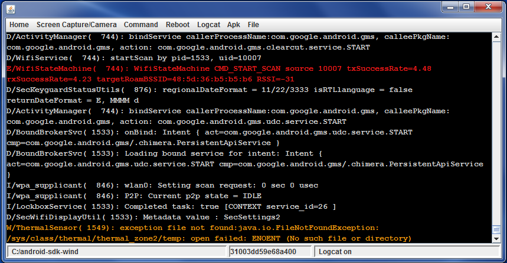
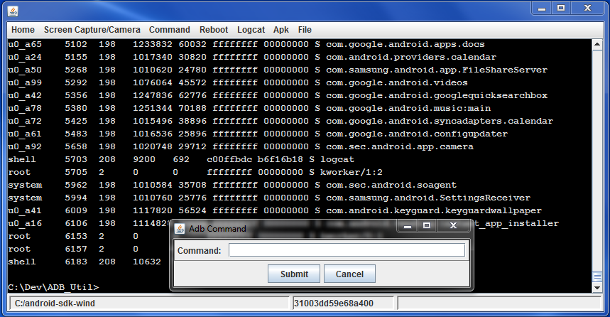

## Utilities for ADB.

# Features:

* Runs on Windows, Linux and Mac.
* Apk:    'Install apk' and 'Uninstall apk'
* File:   'Push file', 'Pull file' and 'Delete file'

* Logcat:
* Option to show output using app's Process Id
* Color highlighting for Error and Warning messages
* Filter option to block unwanted tags

* Screen Capture / Camera:    'Take screenshot', 'Pull screenshot', 'Screen Record' and 'Pull camera image'
* Command:    'List PIDs', 'List Packages', 'getprop' and 'Adb Command' Dialog
* Reboot:     'Reboot' and 'Reboot Recovery'
* Select Device:    Select between multiple Emulators or device
* Wireless:   Use adb wireless over Wi-Fi, no root required

# Screenshots:

